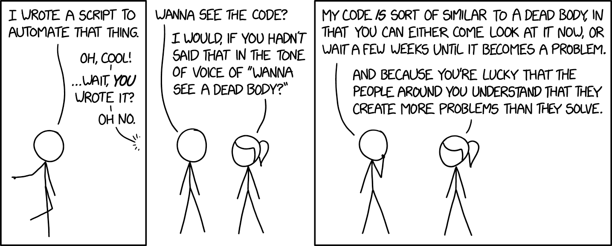

# Standard code block

No YAML chunk options specified

```{r}
x <- 1
print(x)
log(-x)
```

# Exclude source code

Use: ```#| echo: false```

```{r}
#| echo: false
x <- 2
print(x)
log(-x)
```

# Exclude output

Use: ```#| eval: false```

```{r}
#| eval: false
x <- 3
print(x)
log(-x)
```

# Exclude warnings

Use: ```#| warning: false```

```{r}
#| warning: false
x <- 4
print(x)
log(-4)
```

# Suppress everything

Use: ```#| include: false```

```{r}
#| include: false
x <- 5
print(x)
log(-x)
```

# Add a figure

Use: ```#| echo: fenced``` to show entire code block

```{r}
#| echo: fenced
#| out-width: "90%"

```

```{r}
#| echo: fenced
#| out-width: "4in"

```

```{r}
#| echo: fenced
#| out-height: "4in"
knitr::include_graphics("img/pvz-zombie1.pdf")
```
